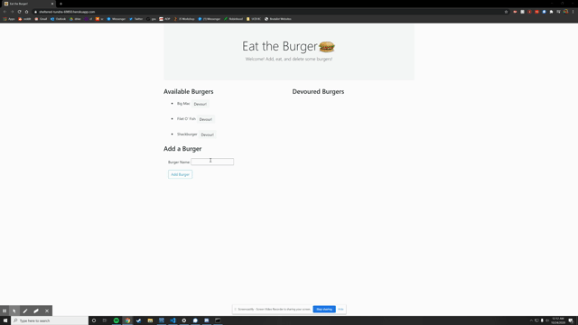

# Burger
Add, devour, and delete burgers with this application.

## Description
This program is a command line application to simulate a virtual restaurant where you can add, eat, and delete burgers on a database. The application primarily utilizes MySQL, Express, and Express Handlebars to function.

## Table of Contents
* [Getting Started](#getting-started)
* [Installation](#installation)
* [Usage](#usage)
* [Author](#author)
* [Acknowledgments](#acknowledgments)
* [License](#license)

## Getting Started
* [Github Repository](https://github.com/nathanmvu/burger)
* [Heroku Deployed Link](https://sheltered-tundra-69850.herokuapp.com/)
* [Usage Demo Video](https://drive.google.com/file/d/1BM-I1kWwmgsridWvZu1X4i86W_KQLLN9/view)



## Installation
To run the program I would recommend testing it from the Heroku deployed link as that makes the process much easier as it uses the JawsDB add-on for Heroku to have a hosted connection and database for the program.
This project uses Node.js so it will need to be installed in order to operate the application.
To install the project, download it from the Github repository. Running the program will require running:
```javascript
npm install
```
to install the necessary npm packages for the program. 
Using MySQL workbench you will need to set up a connection and run the SQL code from the files in the db folder (schema and seed) to set up the Burgers database.
Now you can run:
```javascript
node server.js
```
If the program does not run then you may need to run an:
```javascript
npm install mysql
```
and
```javascript
npm install express
```

## Usage
Initial Screen:


## Author
* Nathan Vu
* [Github](https://github.com/nathanmvu)
* [Email](mailto:nathanvu99@gmail.com)

## Acknowledgments
* Project parameters provided by the UCB Extension Coding Bootcamp

## License
[](https://github.com/tterb/atomic-design-ui/blob/master/LICENSEs)

